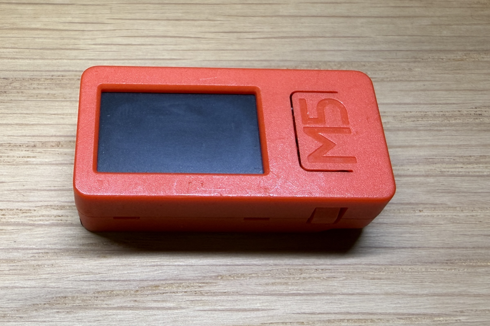
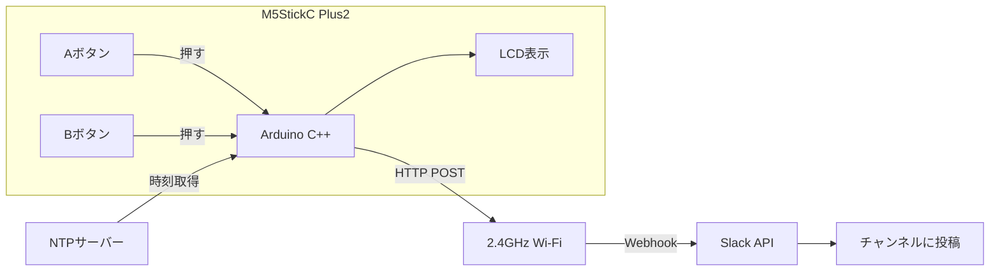
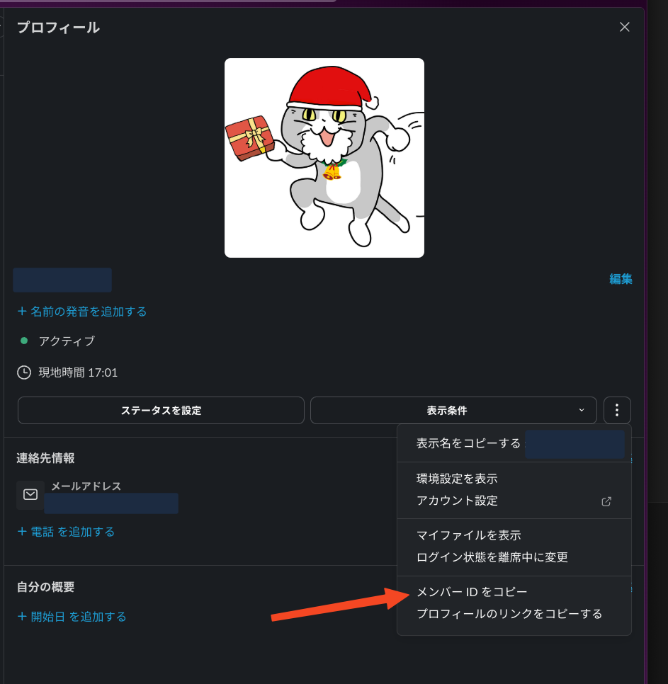
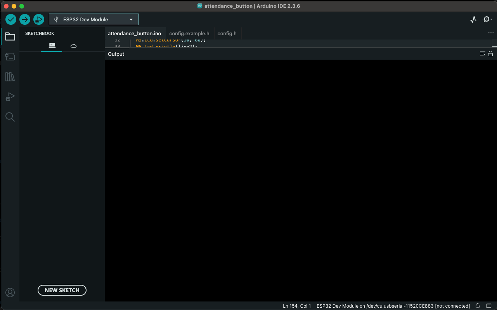
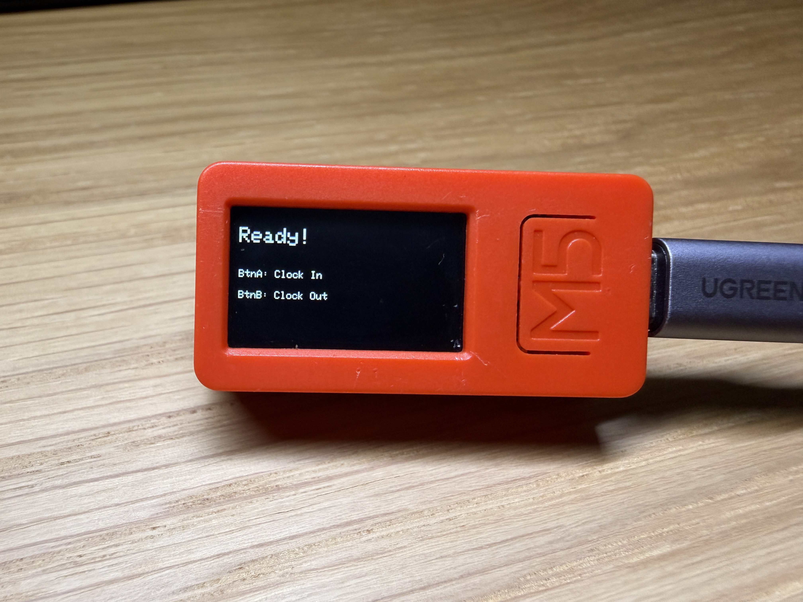
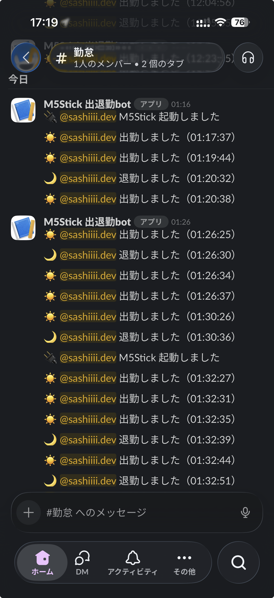

# 初めてのIoT - ボタン1つでSlackに出退勤打刻（M5StickC Plus2）

## はじめに

とあるきっかけで、[知人](https://qiita.com/wicket)より **M5StickC Plus2** を頂きました。



初めて見た時は「なんだこの長細いの…？」という感じでしたが、これがWi-Fi/Bluetooth内蔵のマイコンで、いろいろ作れるらしい。
私は普段IoTやハードウェアは全く触ったことがなかったのですが、せっかくなので勉強がてら何か作ってみることに。

## 何を作る？

「ボタンがあるなら、**押したら何か起きるものを作りたい‼️**」

と、思いついたのが、**Slackに出退勤を投稿するボタン**です。
毎日の「出勤します」「退勤します」の投稿が、ボタン1つで完了します。

### 全体像



### この記事で作るもの

- **Aボタン（正面）** → 出勤メッセージ
- **Bボタン（側面）** → 退勤メッセージ

### 対象読者

- Arduino / ESP32 初心者　/ 「物理ボタン × Slack」を試してみたい人
- IoTに興味があるエンジニア

---

## 必要なもの

### ハードウェア

| 品名 | 備考 |
|------|------|
| M5StickC Plus2 | Amazonやスイッチサイエンスで購入可 |
| USB-Cケーブル | データ転送対応のもの |

> **ESP32とは？**
> Wi-Fi/Bluetooth内蔵の小型マイコン。Arduino IDEで開発でき、IoTデバイスによく使われています。M5StickC Plus2はESP32を搭載した製品です。

### ソフトウェア

- [Arduino IDE 2.x](https://www.arduino.cc/en/software)
- Slackワークスペース（Webhook作成権限）

### ネットワーク

- **2.4GHz Wi-Fi**（必須）

> ⚠️ ESP32は **5GHz Wi-Fiに非対応** です。2.4GHz帯のSSIDを使用してください。

---

## 手順

### 1. Slack Incoming Webhook を作成

Slackにメッセージを送るための「Webhook URL」を取得します。

1. [Slack API](https://api.slack.com/apps) にアクセス
2. **Create New App** → **From scratch**
3. App名（例：`出退勤ボタン`）とワークスペースを選択 → **Create App**
4. 左メニュー → **Incoming Webhooks** → **On** に切り替え
5. **Add New Webhook to Workspace** → 投稿先チャンネル選択 → **許可**
6. 表示された **Webhook URL** をコピー

```text
https://hooks.slack.com/services/<WorkspaceID>/<AppID>/<Secret>
```

> ⚠️ **Webhook URLは絶対に公開しない！** これが漏れると誰でも投稿できてしまいます。

---

### 2. SlackユーザーIDを確認

メッセージにメンションを付けるため、自分のユーザーIDを確認します。

1. Slackで自分のプロフィールを開く
2. **︙（その他）** → **メンバーIDをコピー**



`U0123456789` のような形式のIDが取得できます。

---

### 3. Arduino IDE セットアップ

M5Stickにプログラムを書き込むには **Arduino IDE** というものを使うらしい？🧐
調べてみると、マイコン開発の定番ツールのようで無料で使えます。

1. [Arduino IDE 2.x](https://www.arduino.cc/en/software) をダウンロード・インストール



#### ESP32ボードを追加

Arduino IDEを開いたら、M5Stick（ESP32）を認識させるための設定をします。

1. **Settings（Preferences）** を開く
2. **Additional boards manager URLs** に以下を追加：

   ```text
   https://raw.githubusercontent.com/espressif/arduino-esp32/gh-pages/package_esp32_index.json
   ```

3. **Boards Manager** を開き、`esp32` を検索 → **Install**

#### M5StickCPlus2ライブラリをインストール

1. **Tools** → **Manage Libraries...**
2. `M5StickCPlus2` を検索 → **Install**

---

### 4. コードを準備

GitHubからコードを取得します。

```bash
git clone https://github.com/AyumiSashitani/m5stick-slack-attendance.git
cd m5stick-slack-attendance
```

#### config.h を作成

`attendance_button/config.example.h` をコピーして `config.h` を作成：

```bash
cp attendance_button/config.example.h attendance_button/config.h
```

`config.h` を編集：

```cpp
#pragma once

// Wi-Fi（2.4GHzのみ対応）
#define WIFI_SSID "YOUR_WIFI_SSID"
#define WIFI_PASS "YOUR_WIFI_PASSWORD"

// Slack Incoming Webhook URL（絶対に公開しない）
#define SLACK_WEBHOOK_URL "https://hooks.slack.com/services/XXX/YYY/ZZZ"

// SlackユーザーID（プロフィールからコピー）
#define SLACK_USER_ID "U0123456789"
```

---

### 5. 書き込み

1. Arduino IDEで `attendance_button/attendance_button.ino` を開く
2. M5StickをUSBで接続
3. **Tools** メニューで設定：
   - **Board**: `ESP32 Dev Module`
   - **Port**: 接続したシリアルポート
   - **Upload Speed**: `115200`（重要！）
4. **Upload**（→ボタン）で書き込み

---

## ハマりポイント

### 1. Wi-Fiに繋がらない

**ESP32は2.4GHzのみ対応**です。5GHz Wi-Fiには接続できません。

ルーターの設定で2.4GHzと5GHzのSSIDが分かれているか確認してください。

### 2. Upload時にエラーが出る

```text
Failed uploading: uploading error: exit status 2
```

**Upload Speed を `115200` に下げてください。**

**Tools** → **Upload Speed** → `115200`

### 3. Slackに届かない

- Webhook URLが正しいか確認
- URLの前後に空白や改行が入っていないか確認
- Serial Monitorでログを確認（**Tools** → **Serial Monitor**、115200 baud）

---

## 動作確認

無事に書き込みが完了したら、動作確認です！

### 起動時の流れ

1. Wi-Fi接続中 → `WiFi Connecting...`
2. 接続成功 → `WiFi Connected!`
3. 時刻同期 → `Time Syncing...`
4. Slack送信 → `Slack Sending...`
5. 待機状態 → `Ready!`

### 起動後の画面



起動すると `Ready!` と表示され、ボタンの説明が出ます。

### 動作デモ


### Slackに届くメッセージ



ボタンを押すたびに、時刻付きでSlackに投稿されます。

### M5Stickの画面


| 状態 | 表示 |
|------|------|
| 待機中 | `Ready!` + ボタン説明 |
| 送信中 | `Sending...`（黄色） |
| 成功 | `Sent!`（緑） |
| 失敗 | `Failed!`（赤） |

ボタンを押すとSlackにメッセージが届きます。動いた！🎉

---

## まとめ

初めてIoTを触ってみましたが、**思ったより簡単に動くものが作れて楽しかったです！**
正直、最初は「ハードウェアって難しそう...」と思っていましたが、Arduino IDEのおかげで馴染みやすい開発体験でした。
C++も基本的な書き方だけで十分動きます。

「ボタンを押したらSlackに投稿される」というシンプルなものですが、実際に動くと結構感動します。
IoTに興味はあるけど何から始めればいいか分からない...という方は、ぜひ試してみてください！

ソースコードは以下で公開しています：

👉 [GitHub: m5stick-slack-attendance](https://github.com/AyumiSashitani/m5stick-slack-attendance)

---

## 参考

- [M5StickC Plus2 公式ドキュメント](https://docs.m5stack.com/en/core/M5StickC%20PLUS2)
- [Slack Incoming Webhooks](https://api.slack.com/messaging/webhooks)
- [Arduino ESP32](https://github.com/espressif/arduino-esp32)
